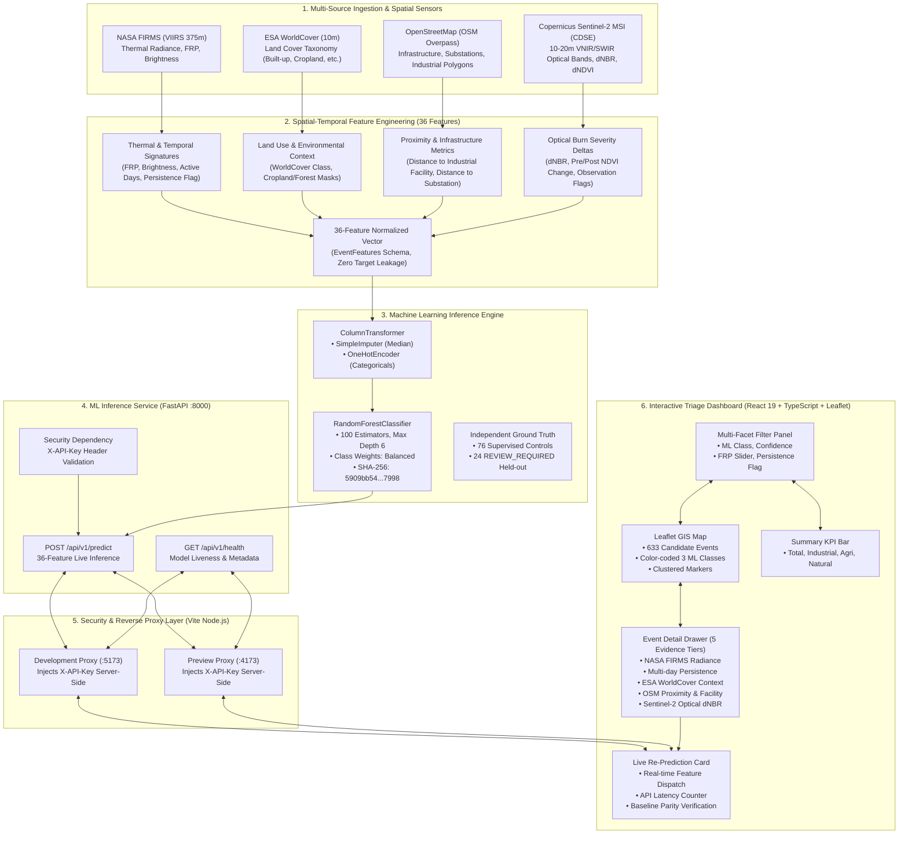
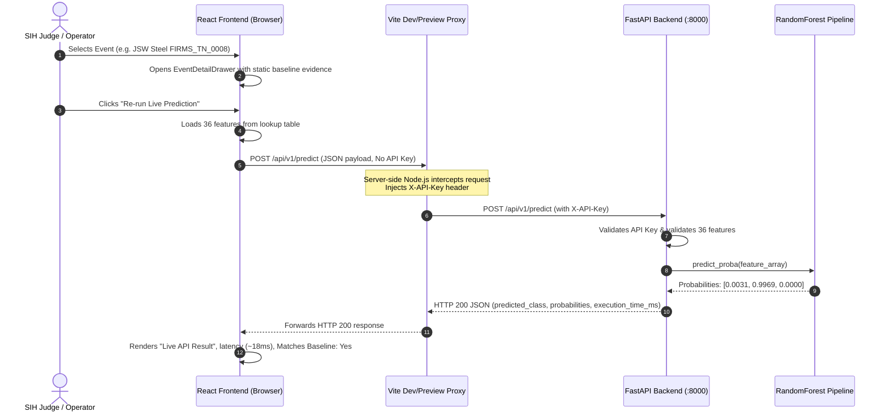

# Industrial Fire Detection & Classification System
## High-Level Architecture & Dataflow Specification

This document details the multi-tiered architecture of the **Industrial Fire Detection & Classification System** designed for the **Smart India Hackathon (SIH) 2026**.

---

## 1. High-Level System Architecture Diagram

---

## 2. Component Tier Breakdown

### Tier 1: Multi-Sensor & Spatial Ingestion
1. **NASA FIRMS (VIIRS 375 m):** Detects radiometric thermal anomalies at 375 m resolution from Suomi-NPP and NOAA-20/21 satellites. Provides Fire Radiative Power (FRP), brightness temperature, and acquisition timestamp.
2. **ESA WorldCover (10 m):** Global land cover dataset providing baseline ecological categorization (Tree cover, Shrubland, Grassland, Cropland, Built-up, Bare vegetation, Water bodies).
3. **OpenStreetMap (OSM Overpass API / Cache):** Extracts surrounding infrastructure geometries within a 2,000 m radius, calculating proximity to nearest industrial facilities, factories, power substations, and mineral extraction quarries.
4. **Copernicus Sentinel-2 MSI (CDSE API):** Multispectral Instrument providing 10 m to 20 m optical reflectance. Measures pre-fire and post-fire surface burn severity ($\text{dNBR}$) and vegetation health ($\Delta\text{NDVI}$).

### Tier 2: 36-Feature Pipeline
The 36 features capture:
- **Thermal Intensity:** `frp`, `brightness`, `brightness_difference`, `bright_t31`.
- **Temporal Persistence:** `grid_detection_count`, `grid_active_days`, `persistent_location_flag`, `is_stubble_burning_season`.
- **Spatial / Local Context:** `grid_brightness_mean`, `frp_zscore_local`, `brightness_zscore_local`.
- **Land Cover:** One-hot encoded WorldCover classes (`worldcover_Built-up`, `worldcover_Cropland`, `worldcover_Tree cover`, etc.).
- **Infrastructure Proximity:** `distance_to_facility_m`, `near_industrial_500m`, `near_industrial_1000m`, `nearest_facility_category`.
- **Optical Surface Change:** `s2_dnbr_mean`, `s2_pre_ndvi_mean`, `s2_post_ndvi_mean`, `s2_change_status`.

### Tier 3: Machine Learning Inference Core
- **Pipeline:** Serialized `sklearn.pipeline.Pipeline` (`final_model.joblib`).
- **Preprocessor:** `ColumnTransformer` with median imputation for missing numericals and one-hot encoding for categoricals.
- **Classifier:** `RandomForestClassifier(n_estimators=100, max_depth=6, class_weight='balanced', random_state=42)`.
- **Target Classes:**
  1. `Agricultural Burning`
  2. `Industrial Thermal Activity`
  3. `Natural / Wildfire / Other`
- **Integrity Digest:** SHA-256 `5909bb546fc55aeffd37b7bb601e96718709fe685e987705b246bb2963279798`.

### Tier 4: FastAPI Backend Service
- **Framework:** FastAPI with Uvicorn ASGI server running on `127.0.0.1:8000`.
- **Endpoints:**
  - `GET /api/v1/health`: Checks model loading state, returns feature count and SHA-256.
  - `POST /api/v1/predict`: Accepts 36 features, runs inference in $\le 25\text{ ms}$, returns predicted class and probability distribution.
- **Security:** Requires `X-API-Key` header validated via dependency injection (`src/api/security.py`).

### Tier 5: Reverse Proxy & Security Perimeter
- Configured in `frontend/vite.config.ts` for both development (`:5173`) and production preview (`:4173`).
- Injects `X-API-Key` strictly on the Node.js server side.
- Zero secrets or API keys are bundled into client-side JavaScript or exposed in browser network requests.

### Tier 6: Interactive GIS Triage Dashboard
- **Framework:** React 19 + TypeScript + Leaflet + Vanilla CSS.
- **Data:** Master 633-event dataset (`dashboard_events_633.csv`, SHA-256: `f74d1a96...93eb`).
- **Key Modules:**
  - `FireMap`: Leaflet map with custom marker styling according to ML class.
  - `FilterPanel`: Multi-dimensional filtering by class, confidence, FRP, and persistence.
  - `EventDetailDrawer`: Slide-over drawer presenting 5 evidence tiers and scientific disclaimers.
  - `LivePredictionCard`: Re-runs prediction against the live FastAPI service on demand.
  - `BackendStatusBadge`: Polls `/api/v1/health` with retry backoff and overlap protection.

---

## 3. End-to-End Live Prediction Flow

